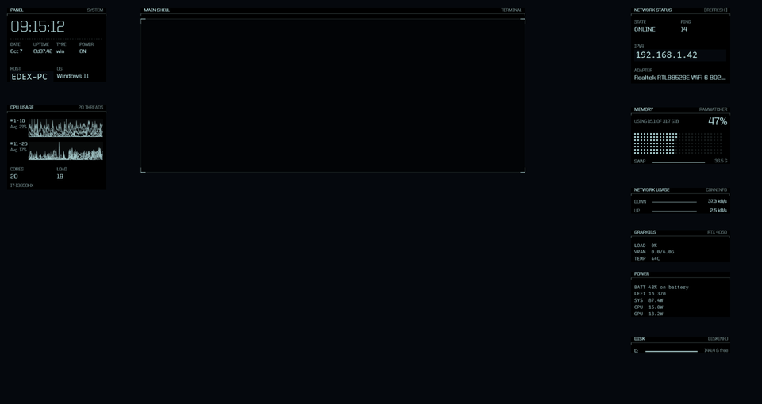
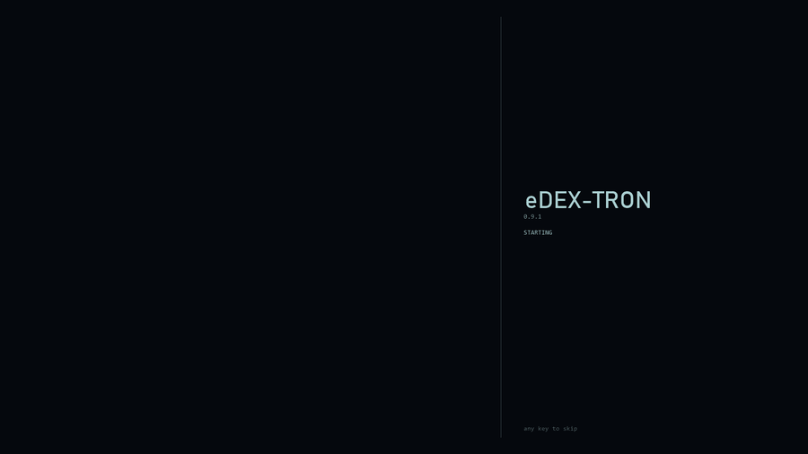

# eDEX-Tron

A Windows 11 desktop theme inspired by **[eDEX-UI](https://github.com/GitSquared/edex-ui)**
— the sci-fi terminal interface by **Gabriel "Squared" Saillard**. It brings
eDEX-UI's look to your whole desktop while you keep using Windows normally:
live system panels, a built-in shell, a shortcut dock, and a matching colour
scheme across Windows, the taskbar, Windows Terminal, VS Code and Office.



<p align="center"><em>Live panels, composited from the theme's own windows.</em></p>

> **Version 0.9 — pre-release.** It works day to day, but it is still changing.
> Everything it changes is backed up and can be undone.

> **On Linux?** There is a separate Linux edition for Ubuntu 26.04 (GNOME)
> with more features: a real terminal built into the HUD, a file browser that
> follows it, open-ports and disk panels, multi-monitor support, whole-system
> theming, screen effects, hotkeys and a boot theme. See
> **[linux/README.md](linux/README.md)**; downloads are under the
> `v0.9.0-linux` release.

## Credit

This project would not exist without **eDEX-UI** by Gabriel "Squared" Saillard
(GPL-3.0). Its colour palette, panel design and home-screen layout are the
basis of everything here. eDEX-Tron is an independent fan project and is not
affiliated with or endorsed by eDEX-UI. See
[THIRD-PARTY-NOTICES.md](THIRD-PARTY-NOTICES.md).

---

## What you get

- **Live HUD** on the desktop, behind your windows: clock, uptime and machine
  info; per-core CPU graphs; memory map; network status (with a refresh
  button); network usage graph; top processes; a folder of your choosing
  (your games by default) as clickable icons. Optionally **disk space**,
  **listening ports** and **graphics card** panels too.
- **Main shell** — a real Command Prompt that sits inside an eDEX-style frame
  and is put back if anything moves it.
- **Dock** of your apps, and a **Desktop** panel that mirrors your Desktop
  folder and updates itself. Real desktop icons are hidden while the theme is on.
- **Layout profiles** — named panel sets, switched in one go.
- **Boot screen** — eDEX's startup log when the theme comes up, reporting this
  machine's own hardware, drives, services and uptime rather than a script.
- **Settings window** — colours, which panels you want, the folder panel and
  every switch, without editing a file.
- **Hotkeys and key clicks** — show or hide the HUD, jump to the shell, and an
  optional click on every keystroke.
- **Dark everywhere** — Windows, Windows Terminal, VS Code and Office — in one
  accent colour you can change with a single command.
- **Fits your screen** — the layout is worked out from your resolution and
  scaling, not hard-coded, and panels that will not fit are left off rather
  than drawn on top of each other.
- **One switch** — `eDEX-Tron.exe` turns it all on or off.

## Requirements

- Windows 10 or 11 with **winget** (the "App Installer" from the Microsoft Store)
- An internet connection during setup
- Optional: **eDEX-UI** installed, for its original typeface and sounds

Setup installs what else it needs: Rainmeter, TranslucentTB, Python and a few
Python packages.

## Install

1. Download **`eDEX-Tron-Setup-v0.9.1.exe`** from the
   [v0.9.1 release](../../releases/tag/v0.9.1).
2. Run it. Windows SmartScreen may warn that the app is unrecognised, because
   the installer isn't code-signed: choose **More info → Run anyway**.
3. Confirm the install location (`Documents\eDEX-Tron`). A PowerShell window
   shows progress; Windows may ask for permission while the helper apps
   install, and Explorer restarts once.

That's it — the theme switches on when setup finishes.

Prefer the source? Clone into `Documents\eDEX-Tron` (the scripts expect that
folder) and run:

```bash
powershell -ExecutionPolicy Bypass -File "%USERPROFILE%\Documents\eDEX-Tron\src\setup.ps1"
```

## Using it

**Turn it on or off** — double-click **eDEX-Tron Theme** on the Desktop or in
the Start menu, the **Theme** tile in the dock, or press **Win+Alt+E**.
`eDEX-Tron.exe` also takes `start`, `stop`, `status`, `repair`, `settings`,
`boot` and `relayout`.
Switching off stops the HUD, the taskbar transparency and the background tasks
and brings your desktop icons back; your colours stay until you uninstall.

`status` reports what is actually running, and says so if a panel you asked for
had no room on this screen. Run from a terminal it prints and exits, so it
pipes and scripts like anything else; launched from the dock or a shortcut,
where there is no terminal to print to, it shows the same text in a dialog. **`repair`** is the one to reach for when something
looks wrong: it rebuilds the layout for whatever the screen is now, restarts
anything that has died, puts the shell back in its frame and hides the desktop
icons again.

**Shell** — click the MAIN SHELL panel to open it, or press **Win+Alt+T**. It
is a real Command Prompt window moved into the frame, so it is kept there: move
or resize it and it goes back within a second or two. It is also kept out of
Alt-Tab, since it is part of the HUD rather than a window in its own right —
both of those are switches in Settings.

**Dock** — right-click it, or click **+ EDIT**, to edit `dock.txt` in Notepad.
One app per line: `Label | target [| icon source]`. Targets can be programs,
shortcuts, folders, documents, `ms-settings:` links or Store apps
(`shell:AppsFolder\<id>!App`). Save and close, and the layout rebuilds. The dock
wraps to a second row when it gets long.

**Desktop panel** — shows what's in your Desktop folder and refreshes a moment
after anything changes. Right-click to rescan by hand.

**Folder panel** — the wide panel under the shell mirrors one folder as
clickable icons; it starts as `Desktop\Games`. Point it anywhere in
**Settings**, or by setting `folder` in `theme.json` and running
`src\tools\relayout.ps1`. Like the Desktop panel it follows changes to that
folder, and right-click rescans it.

**Settings** — the **CUSTOMISE** tile on the dock, **eDEX-Tron Settings** in
the Start menu, or **Win+Alt+S**. Colours, which panels you want, the folder
panel and every switch are all there, and it applies the change for you.

**Hotkeys**

| | |
|---|---|
| **Win+Alt+H** | hide or show the whole HUD |
| **Win+Alt+T** | open the shell, or jump to it |
| **Win+Alt+E** | turn the theme off or on |
| **Win+Alt+S** | these settings |

Turn them off in Settings if they clash with something.

**Extra panels** — **GPU** (load, memory and temperature: `nvidia-smi` where it
exists, performance counters otherwise), **POWER** (see below), **DISK** (free
space per drive) and **PORTS** (what is listening, and which program holds it).
Switch them on in Settings. A small screen may not have room for all four: one
marked *no room* is switched on but could not fit, and turning one of the
standard panels off gives it the space. Nothing is ever drawn on top of
anything else.

**Power** — what the machine is actually drawing, in watts. Windows will tell
you without any driver or elevation if you know where to ask, and the panel
prints only the lines your hardware can answer:

| Row | Where it comes from |
| --- | --- |
| `BATT` / `LEFT` | `Win32_Battery` and `root\WMI BatteryStatus` — laptops only |
| `SYS` | the ACPI power meter, or the battery's own discharge rate |
| `CPU` | Intel RAPL, via the `Energy Meter` performance counters |
| `GPU` | `nvidia-smi power.draw`, or RAPL's integrated-graphics domain |

A desktop has no battery and usually no ACPI meter, so it shows processor and
card and the panel is sized for three rows instead of five — there is no
whole-system wattage to be had on a desktop without a kernel driver or a meter
at the wall, and the panel says what it knows rather than inventing the rest.

**Layout profiles** — a named set of panels you can switch between: one for
gaming, one for working, whatever you like. **Save as** stores whichever panels
are on at that moment, and picking a profile puts them all back at once — the
planner then refits them to this screen, so a profile saved on a big monitor
still does something sensible on a small one.

Profiles hold the panel choice and nothing else. A profile that also carried
your colours or your folder path would make switching one a bigger surprise
than the name suggests. Change the panels by hand and the name clears, because
what is on screen is no longer the profile it claims to be.

```bash
powershell -File src\tools\settings.ps1 -SaveProfile gaming
powershell -File src\tools\settings.ps1 -Profile work
```



**Boot screen** — the theme opens with eDEX's startup log. Everything in it is
read off the machine as it scrolls: the real processor, memory, drives, display
adapter, network links, the services Windows actually has running, and how long
you have been up. Any key skips it; turn it off in Settings.

It comes up on every display: one window does the work and the others mirror
it, so there is one log, one timer and one sound however many screens you
have. The text scales with each screen, then takes `bootscale` off that —
half by default, which leaves the lower part of the screen free.

A sound plays over it: Watch Dogs' boot sequence, which is what the screen was
built around. `bootsoundspeed` plays it faster than recorded (1.6 by default),
and it fades out when the screen closes rather than cutting. To use something
else, drop a `boot.mp3` or `boot.wav` into `assets\sounds\` or point `bootsound`
in `theme.json` anywhere you like. That audio is Ubisoft's, credited in
[THIRD-PARTY-NOTICES.md](THIRD-PARTY-NOTICES.md) and not ours to license on;
delete the file and the screen runs silently.

**Key clicks** — an optional click on every keystroke, off by default. The
audio device is opened once and kept open, and each press is layered over
whatever is still sounding rather than cutting it off, using six variants of the
sample at slightly different length and level — so typing sounds like typing
rather than one sample on repeat. The variants are time-stretched rather than
resampled, so they stay the same keyboard instead of becoming six of them.
Holding a key is one click, not thirty a second.

Two numbers in `theme.json` tune it: `keyclickms` is how long a click lasts
(43ms by default, with the variants spread five per cent either side), and
`keyclickvolume` is how loud, as a percentage (75 by default). The level is
baked into the samples rather than set on the audio device, so turning the
clicks down leaves everything else playing at the volume you chose.

The click that ships is a recording of a real keyboard, at
`assets\sounds\key.wav`, which the launcher prefers. A synthesised one sits at
`assets\sounds\gen\key.wav` (`src\tools\gen_sounds.py`) as a fallback. To use a
recording of your own keyboard instead, overwrite `key.wav`:

```bash
python src\tools\sample_click.py <a recording of typing> --report
```

That finds the individual presses, takes the clearest, trims and levels it, and
warns when the clip it produced holds more than one press — which plays as that
many clicks per key, and is not obvious until you type. `--whole` skips the
search, for a file that is already a single sound.

To tell a new press from Windows repeating a key you are holding, the hook reads
which key was pressed. It is used as an index into an is-this-key-down table and
nothing else: no key is recorded, counted or passed on.

**Typeface** — four sets, chosen in Settings or as `font` in `theme.json`:

| `font` | What you get |
| --- | --- |
| `auto` | the best set present: United Sans, else Fira, else Windows' own |
| `unitedsans` | eDEX-UI's own look. Needs eDEX-UI installed to copy out of |
| `fira` | Fira throughout, captions included. Ships with the project |
| `windows` | Bahnschrift and Consolas, already on every Windows 10/11 |

Settings only offers the sets whose files are actually on the machine, because
a missing font is not an error anywhere: Windows hands back Microsoft Sans
Serif and the HUD renders in the wrong typeface while looking like it worked.
For the same reason the family names are never written by hand — `woff2ttf.py`
reads each file's own name into `build/ttf/families.json` and the skins are
generated from that.

**Colours** — all colours live in `theme.json`. Settings has a colour
picker; from a terminal:

```bash
powershell -ExecutionPolicy Bypass -File "%USERPROFILE%\Documents\eDEX-Tron\src\retheme.ps1" -Accent "#ff9f1c"
```

Options: `-Accent`, `-Background`, `-IconColor` (each `#RRGGBB`) and
`-Grid on|off`. The theme is dark-only, so light backgrounds are refused.

**Changed resolution or scaling?** Nothing to do — the theme notices and
rebuilds itself a few seconds later, whether you changed the resolution, the
scaling, the number of monitors, or just moved the taskbar.
`eDEX-Tron.exe relayout` forces it, and `runtime\watcher.log` records what it
noticed and what it did.

**Taskbar styling (optional)** — Windhawk mods can add accent lines to the
taskbar; see [windhawk/taskbar-styler.md](windhawk/taskbar-styler.md).

## Uninstall

```bash
powershell -ExecutionPolicy Bypass -File "%USERPROFILE%\Documents\eDEX-Tron\src\uninstall.ps1"
```

Restores everything setup backed up — accent, dark mode, wallpaper, Office and
VS Code settings, sounds — brings back desktop icons, and removes the fonts,
panels and shortcuts. Rainmeter, TranslucentTB and Python stay installed;
remove them with `winget uninstall` if you like.

## Known limitations

- Primary display only.
- A small screen cannot fit every optional panel at once; Settings says which
  one missed out and `status` repeats it.
- The Windhawk taskbar styling is manual.
- The installer is not code-signed yet.
- The GPU panel reports a temperature only where `nvidia-smi` exists; AMD and
  Intel expose load and memory to Windows but not temperature.
- Without eDEX-UI installed, eDEX-UI's own United Sans is unavailable (it is
  commercial and can't be redistributed); the Fira and Bahnschrift sets are.

## Licence

GPL-3.0 — see [LICENSE](LICENSE). Third-party components are listed in
[THIRD-PARTY-NOTICES.md](THIRD-PARTY-NOTICES.md).

---

## For developers

```
dock.default.txt / theme.default.json   starting settings (setup copies them)
themes/edex/tron.json   eDEX-UI's palette
themes/terminal, vscode app colour schemes
skins/eDEX-Tron/@Resources  scripts the panels run
src/setup.ps1           first-time setup
src/install.ps1         applies the theme (and backs up first)
src/retheme.ps1         colours
src/uninstall.ps1       reverts
src/tools/              generators and helpers
src/dev/                verification scripts used while developing
windhawk/               optional taskbar styles
linux/                  the Linux edition (see linux/README.md)
```

| Tool | Purpose |
|---|---|
| `relayout.ps1` | Measures the screen, plans the layout, regenerates and deploys every panel |
| `gen_rainmeter_ini.py` | The layout planner (logical, DPI-scaled pixels) |
| `gen_skins.py` | Generates the Rainmeter panels |
| `gen_dock.ps1` | Builds the dock (from `dock.txt`) or the Desktop grid (from a folder), extracting real icons |
| `make_wallpaper.py`, `gen_icon.py` | Render the wallpaper and launcher icon from `theme.json` |
| `settings.ps1` | Reads and writes every setting, and rebuilds what each change affects |
| `gen_sounds.py` | Renders the key click (`assets/sounds/gen/key.wav`) |
| `build_launcher.ps1` | Compiles `eDEX-Tron.exe` with the C# compiler built into Windows |
| `launcher.cs`, `SettingsForm.cs`, `BootScreen.cs` | Its source: the switch and background tasks, the settings window, the boot screen |
| `bootstrap_assets.ps1` | Copies fonts and sounds out of a local eDEX-UI install |
| `build_release.ps1` | Builds the setup exe and source zip into `dist/` |
| `run_outside.ps1` | Runs a script outside an app container (see below) |

The settings window holds no logic of its own: it reads `settings.ps1 -Get` and
writes back by calling the same script, so the two cannot disagree about what a
setting means. `settings.ps1` works perfectly well on its own.

| Check | What it is for |
|---|---|
| `src\dev\test_plan.py` | 13824 layouts asserted free of overlaps and off-screen panels. Run it after touching the planner: Rainmeter reports nothing when two skins land on top of each other |
| `src\dev\skin_rects.ps1` | Where the panels actually ended up, live |
| `src\dev\capture_window.ps1` | A picture of one window, by title — never the whole screen |
| `src\dev\verify_uninstall.ps1` | Snapshots the 50 registry values, files and shortcuts the theme touches. Snapshot before installing, snapshot again after uninstalling, compare: an empty report means everything came back. It reads those places directly rather than following the backup's own list, so a value the backup forgot still shows up |

**Building a release:** commit, then run `src\tools\build_release.ps1`.

**Don't run the scripts from inside a packaged (MSIX) app** such as the Claude
desktop app or the Store build of Windows Terminal: those redirect writes to
`%APPDATA%`/`%LOCALAPPDATA%` into a private container that nothing else can
see. `run_outside.ps1` works around it by going through Task Scheduler.

### Things that fail silently (and cost real time)

- Rainmeter positions skins in logical (DPI-scaled) pixels.
- Rainmeter merges same-named sections without an error — `gen_skins.py`
  refuses to write duplicates.
- `ClipString=1` clips to `H`; 12pt text needs `H` of about 22.
- `AutoScale` is a meter option, not a measure option.
- `RunCommand` only runs when sent `[!CommandMeasure ... "Run"]`.
- FileView has no parent/child measures and no icon type: every measure needs
  its own `Path`, or it lists your drives.
- `UsageMonitor`'s Process category crashes Rainmeter on Windows 11 25H2.
- `BackgroundType` 2/3 (slideshow/Spotlight) overrides any wallpaper;
  `AutoColorization` recomputes the accent from it.
- `DWM\AccentColor` is re-derived from the active theme — check
  `AccentColorMenu` or the `UISettings` API instead.
- P/Invoke `FindWindow`/`GetClassName` need `CharSet.Unicode`.
- Task Scheduler kills its process tree; long-lived processes are started with
  `Win32_Process.Create`.
- PowerShell 5.1 turns native stderr into terminating errors under `Stop`,
  writes a BOM with `-Encoding utf8`, and drops empty-string arguments on their
  way to a native command (argparse then reports a missing value).
- `ProcessWindowStyle.Hidden` is inherited: a WinForms process started that way
  shows its first window hidden, with no error and no window.
- Rainmeter rewrites `Rainmeter.ini` as it shuts down, so a new one has to be
  written only after the process has actually gone.
